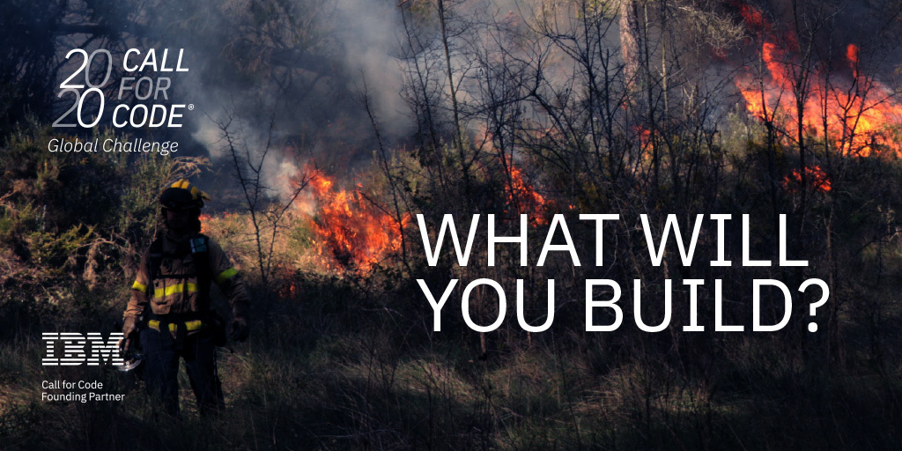

<h1>Welcome to ASEAN IBM Cloud Training for Call for Code</h1>

We have prepared 4 tutorials to show participants how to leverage IBM Cloud for the hackathon!

1. In the first segment, we will teach you how to build a Chatbot using IBM Waston Assistant and some other AI Services on IBM Cloud

2. As well as a quick tutorial on using IBM Watson Studio for Data Scientists joining the competition!

3. For more advanced users, please check out the last segment!
